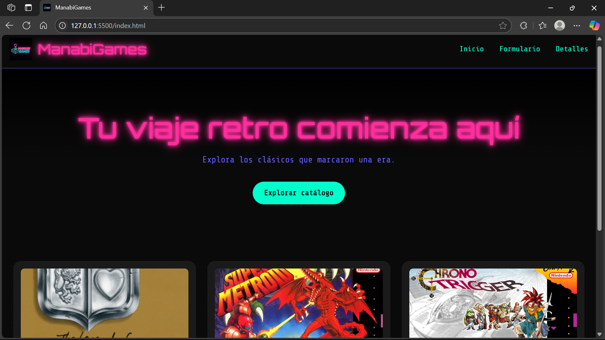

 🎮 ManabiGames

**ManabiGames** es un catálogo retro interactivo de videojuegos clásicos de consolas como NES y SNES. El sitio permite explorar juegos, ver sus detalles y enviar un formulario de contacto, todo con un estilo visual synthwave/neón inspirado en los años 80 y 90.

---

## 🚀 Descripción del proyecto

Este proyecto fue desarrollado como parte de una evaluación de desarrollo web. Incluye:

- Catálogo dinámico de videojuegos cargado desde JavaScript.
- Página de detalles generada por ID desde URL.
- Formulario de contacto con validaciones (HTML5).
- Diseño responsive con **Tailwind CSS** (via CDN).
- Estética retro/synthwave con tipografías neón y cuadrícula espacial.
- Código organizado, comentado y dividido por funcionalidades.

---

## 🛠️ Instrucciones de ejecución

1. Clona o descarga este repositorio.
2. Asegúrate de tener una estructura como esta:

/
├── index.html
├── detalles.html
├── formulario.html
├── js/
│ ├── main.js
│ └── detalles.js
├── assets/
│ ├── covers/
│ └── logo/

3. Abre `index.html` en tu navegador. No necesitas servidor local, ya que todo es HTML/CSS/JS puro.

---

## 🖼️ Captura de pantalla

---

## 🌐 Enlace al despliegue

[🔗 https://divilota.github.io/ManabiGames/]

---

## 🧠 Autor

Diego Maximiliano Villota Bravo 
